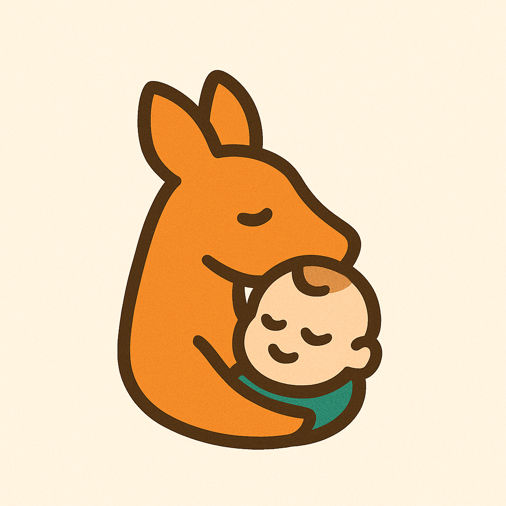

  

# Karu – Transformando o Cuidado Neonatal

O **Karu** é uma iniciativa voltada para enfrentar um desafio central da saúde pública:  
o acompanhamento contínuo e humanizado de recém-nascidos em situação de risco.

## 🔍 Problema
O acompanhamento neonatal ainda sofre com informações fragmentadas e dificuldade de integração entre equipes de saúde.  
Essa realidade impacta diretamente a qualidade do cuidado e a rapidez das intervenções necessárias.

## 💡 Solução
O Karu propõe uma plataforma que centraliza dados em dashboards intuitivos,  
oferecendo suporte à tomada de decisão e alinhando-se a diretrizes como o **Método Canguru**.

Este repositório apresenta o **protótipo inicial de telas**, que servirá de base para evolução da solução.

## 🤝 Parceria
Projeto desenvolvido em colaboração com a **Secretaria de Saúde**, com foco em impacto real, inovação prática e fortalecimento da saúde neonatal.
